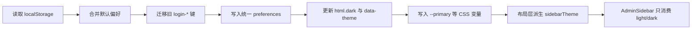

# 主题偏好与 CSS Token 设计

本文记录 `apps/page` 当前采用的主题色切换、暗黑模式、侧边栏主题和 CSS 变量组织方式。目标不是完整复刻 Vben 的偏好设置系统，而是保留它在主题架构上的关键设计：单一偏好源、统一写入 DOM、组件只消费派生后的主题结果。

## 参考结论

Vben 的实现不是让每个组件各自保存主题状态，而是通过偏好设置管理器统一处理：

| 设计点   | Vben 思路                                | 当前项目落地                                                                    |
| -------- | ---------------------------------------- | ------------------------------------------------------------------------------- |
| 状态来源 | `preferences` 作为主偏好对象             | `src/composables/preferences.ts` 作为统一主题偏好入口                           |
| 存储方式 | 主偏好对象 + `theme` / `locale` 快速镜像 | `admin-backend-3-page-preferences` + `preferences-theme` / `preferences-locale` |
| 暗黑模式 | 给 `html` 添加 `dark` 类                 | 只使用 `html.dark`，废弃旧的 `app-dark`                                         |
| 内置主题 | `data-theme` 表示内置主题类型            | `data-theme="default"`，不再用 `light` / `dark` 塞进 `data-theme`               |
| 主题色   | 由偏好对象生成 CSS 变量                  | `colorPrimary` 写入 `--primary` 和 Element Plus 主色变量                        |
| 侧边栏   | 由布局层计算 `sidebarTheme` 后传入组件   | `MainLayout` 计算并传给 `AdminSidebar`                                          |

## 本次修复的问题

之前的实现存在几个容易互相打架的点：

| 问题                             | 影响                                           | 处理                                       |
| -------------------------------- | ---------------------------------------------- | ------------------------------------------ |
| 登录页、后台页分别读写主题状态   | 登录页切换主题后，后台页可能不同步             | 合并到统一 preferences                     |
| 使用 `app-dark`                  | 和 Vben 的 `dark` 约定不一致，也让样式入口变多 | 全部改为 `dark`                            |
| `data-theme` 存 `light` / `dark` | 混淆“色彩模式”和“内置主题类型”                 | 固定使用 `default`，后续主题预设再扩展     |
| `AdminSidebar` 默认 dark         | 清空本地存储后，页面是亮色但侧边栏仍可能变暗   | 由布局层传入 `sidebarTheme`                |
| `.light` 类重置 `--primary`      | 侧边栏会把用户选择的主题色重新变成默认蓝色     | 动态主题色只放在根变量，不放到组件主题类里 |

## 状态结构

当前偏好对象只保留第一版必要字段：

```ts
type Preferences = {
  app: {
    authPageLayout: "center" | "left" | "right";
    locale: "zh-CN" | "en-US";
  };
  theme: {
    builtinType: "default";
    colorPrimary: string;
    colorSuccess: string;
    colorWarning: string;
    colorDestructive: string;
    mode: "light" | "dark" | "auto";
    radius: string;
    fontSize: number;
    semiDarkHeader: boolean;
    semiDarkSidebar: boolean;
    semiDarkSidebarSub: boolean;
  };
};
```

存储键如下：

| Key                                       | 用途                                          |
| ----------------------------------------- | --------------------------------------------- |
| `admin-backend-3-page-preferences`        | 完整偏好对象                                  |
| `admin-backend-3-page-preferences-theme`  | 当前主题模式镜像，例如 `{ "value": "light" }` |
| `admin-backend-3-page-preferences-locale` | 当前语言镜像，例如 `{ "value": "zh-CN" }`     |

旧版 `admin-backend-3-page-login-*` 会在初始化时迁移一次，然后删除。

## 运行流程



## CSS 组织规则

### 1. 根变量负责动态主题色

`--primary`、`--success`、`--warning`、`--destructive`、`--font-size-base`、`--radius` 这类动态变量只由 preferences 写到 `document.documentElement.style`。

这样做的原因是：用户选择主题色后，所有组件都应该继承同一个根变量，不能被局部 `.light` 或 `.dark` 类重置。

### 2. `.dark` 只负责色彩模式

`src/styles/index.css` 中的 `.dark` 负责暗黑模式下的背景、文字、边框、输入框、侧边栏等模式变量：

```css
.dark {
  --background: 222.34deg 10.43% 12.27%;
  --background-deep: 220deg 13.06% 9%;
  --foreground: 0 0% 95%;
  --sidebar: 222.34deg 10.43% 12.27%;
  --sidebar-deep: 220deg 13.06% 9%;
}
```

亮色默认值放在 `:root`。当前不再给 `.light` 写完整变量块，避免局部组件把动态主题色覆盖回默认值。

### 3. 侧边栏不自己决定主题

侧边栏只接收布局层传入的 `theme`：

```ts
const sidebarTheme = computed(() =>
  isDark.value || preferences.theme.semiDarkSidebar ? "dark" : "light",
);
```

这和 Vben 的做法一致：布局层根据全局主题与半暗侧边栏配置计算结果，组件只负责渲染。

### 4. 菜单变量消费根主题色

菜单 active 状态使用：

```css
--menu-item-active-color: hsl(var(--primary));
--menu-item-active-background-color: hsl(var(--primary) / 15%);
```

因此主题色从蓝色切换到绿色后，侧边栏 active 背景也会同步变成绿色透明背景。

## 文件边界

| 文件                                     | 职责                                         |
| ---------------------------------------- | -------------------------------------------- |
| `src/composables/preferenceStorage.ts`   | 只放存储 key，无副作用，可被 API 层引用      |
| `src/composables/preferences.ts`         | 偏好对象、迁移、保存、DOM 变量写入、派生主题 |
| `src/composables/useAppTheme.ts`         | 后台布局使用的轻量主题入口                   |
| `src/composables/useLoginPreferences.ts` | 登录页使用的偏好入口                         |
| `src/styles/index.css`                   | 全局主题 token 与 Element Plus 基础变量      |
| `src/components/layout/AdminSidebar.vue` | 侧边栏消费布局传入的 `light` / `dark`        |

## 审计结果

本次完成后已验证：

| 验证项                                | 结果                                                                    |
| ------------------------------------- | ----------------------------------------------------------------------- |
| 清空主题相关 storage 后刷新 dashboard | 自动生成统一 preferences，旧 login key 不再出现                         |
| 默认亮色模式                          | `html` 无 `dark` 类，`data-theme="default"`，侧边栏为 `light`           |
| 点击顶部主题切换                      | `html.dark` 生效，storage 写入 `{ "value": "dark" }`，侧边栏变为 `dark` |
| 修改主色后刷新                        | `--primary` 与 Element Plus 主色变量同步更新                            |
| 侧边栏 active 背景                    | 跟随当前 `--primary`，不再被 `.light` 重置                              |
| 自动化检查                            | `pnpm check`、`pnpm test`、`pnpm build` 通过                            |

## 后续扩展

| 方向                  | 说明                                                       |
| --------------------- | ---------------------------------------------------------- |
| 内置主题预设          | 当前只保留 `default`，后续可增加 `violet`、`sky` 等 preset |
| 偏好设置面板          | 当前只有登录页工具栏和顶部暗黑切换，后续可增加完整配置抽屉 |
| `auto` 模式 UI        | 类型已预留 `auto`，但当前 UI 只在 light / dark 间切换      |
| Element Plus 颜色阶梯 | 当前使用透明度生成主色阶梯，后续可引入更完整的颜色生成算法 |
